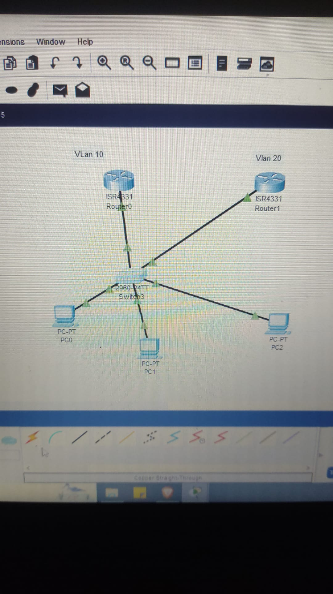

# Lab10 -VLANs PROFESORES y ESTUDIANTES
## Objetivo

-Crear dos VLANs con 
2 routers (ISR4331) 
1 switch (296024TT)
conectar el switch con copper straight por puerto gigabit0/0 al Router 0
conectar el switch con copper straight por puerto gigabit0/1 al Router 1
VLAN 10 PROFESORES Pc0 y Pc1 
VLAN 20 ESTUDIANTES Pc2

Asignamos direcciones IP Segun Tabla

# Topología básica

Arrastrá 2 routers (Router A y Router B).

Colocá 1 switch.

Conectá 3 PCs ( 2 en VLAN10 y 1 en VLAN20).

Conectá cada PC al switch con cable cobre directo (FastEthernet).

Conectá el switch al Router A (puerto G0/0).

Conectá el switch al Router B (puerto G0/0).

## Evidencia

# Configuración de VLANs y PCs  
## Entrar en cada PC en Desktop - Ip Configuration

PC 0 en VLAN10

IP: 198.100.12.10

Mascara: 255.255.255.0

Gateway: 198.100.12.1

PC 1 en VLAN10

IP: 198.100.12.11

Mascara: 255.255.255.0

Gateway: 198.100.12.1

PC 2 en VLAN20

IP: 200.20.5.20

Mascara: 255.255.255.0

Gateway: 200.20.5.1

(Las demás PCs pueden tener direcciones de la misma red, por ejemplo 198.100.12.11, 200.20.5.21, etc.)

# Configuración de los Routers

## Abrí la CLI de cada router y configurá las interfaces:

Router A

Router>enable
Router#configure terminal
Router(config)#show ip interface brief
GigabitEthernet0/0/0
Router(config)#interface GigabitEthernet0/0/0
Router(config-if)#ip address 198.100.12.1 255.255.255.0
Router(config-if)#no shutdown

Router B

Router>enable
Router#configure terminal
Router(config)#interface GigabitEthernet0/0/0
Router(config-if)#ip address 200.20.5.1 255.255.255.0
Router(config-if)#no shutdown

Volvé a correr:

show ip interface brief

Deberías ver:

GigabitEthernet0/0/0   198.100.12.1   YES manual   up   up

# Configuracion del Switch

## Abrí la CLI de cada router y configurá las interface

Switch>enable
Switch#configure terminal
Enter configuration commands, one per line.  End with CNTL/Z.

Switch(config)#vlan 10
Switch(config-vlan)#name PROFESORES
Switch(config-vlan)#exit
Switch(config)#vlan 20
Switch(config-vlan)#name ESTUDIANTES
Switch(config-vlan)#exit
Switch(config)#interface fastethernet 0/1
Switch(config-if)#switchport mode acces
Switch(config-if)#switchport acces vlan 10
Switch(config-if)#exit
Switch(config)#
Switch#
%SYS-5-CONFIG_I: Configured from console by console

Switch#configure terminal
Enter configuration commands, one per line.  End with CNTL/Z.
Switch(config)#interface fastethernet 0/2
Switch(config-if)#switchport mode acces
Switch(config-if)#switchport acces vlan 10
Switch(config-if)#exit
Switch(config)#interface fastethernet 0/3
Switch(config-if)#switchport mode acces
Switch(config-if)#switchport acces vlan 20
Switch(config-if)#exit
Switch(config)#

## Entrar en configuracion del Switch

# en la columna de puertos elegir:  

GigabitEthernet0/1 y vincularlo con la VLAN10
GigabitEthernet0/2 y vincularlo con la VLAN20

Entrar en el Switch CLI

show vlan brief

Deberías ver algo así:

10   PROFESORES   active   Fa0/1, Fa0/5

Si no aparecen listados → no los asignaste bien.
Para hacerlo:

configure terminal
interface fa0/1
 switchport mode access
 switchport access vlan 10
exit

Desde la PC0

Hacés:

ping 198.100.12.1

Si esta todo bien mostrara alho parecido a esto:

Pinging 198.100.12.1 with 32 bytes of data:

Reply from 198.100.12.1: bytes=32 time<1ms TTL=255
Reply from 198.100.12.1: bytes=32 time<1ms TTL=255
Reply from 198.100.12.1: bytes=32 time=3ms TTL=255
Reply from 198.100.12.1: bytes=32 time<1ms TTL=255

Ping statistics for 198.100.12.1:
    Packets: Sent = 4, Received = 4, Lost = 0 (0% loss),
Approximate round trip times in milli-seconds:
    Minimum = 0ms, Maximum = 3ms, Average = 0ms

Desde la PC1

Hacés:

ping 198.100.12.1

Desde la PC3

Hacés:

ping 200.20.5.1

## Reflexión

Este fue mi primer laboratorio completo de VLANs con inter-VLAN routing.

Aprendí a crear VLANs y asignar puertos.

Configuré un router-on-a-stick para permitir comunicación entre PROFESORES y ESTUDIANTES.

Entendí la importancia de los gateways para la comunicación entre subredes.

Próximo paso: practicar ACLs (listas de control de acceso) para que ciertas VLANs puedan o no comunicarse.

## DESCARGAR PROYECTO PACKET TRACER LAB10 VLANs

[Descargar archivo Packet Tracer](../packet-tracer/lab10-vlans25-8.pkt)

